# my_Capstone_Budget_Buddy_Project
# Project Name ::  BUDGET BUDDY

This GitHub project involves the development of a comprehensive full-stack application designed to help users manage their income and expenses efficiently. The application provides tools for budget management and analysis, offering visual representations through charts and graphs.

# Git Repository Name ::  [my_Budget_Buddy_Capstone_project](https://github.com/DeneshA/my_Budget_Buddy_Capstone_project)

# DENESH ANANDATHASAN [Portfolio](https://github.com/DeneshA/myPortfolio) # [LinkedIn](www.linkedin.com/in/deneshananthadasan)

# A Closer Look at the Project...
 
 The Budget Buddy App (BBA) addresses the critical need for individuals to gain insights into their financial status, encompassing their overall incomes and expenses, along with contributions on various time scales such as weekly, biweekly, and monthly intervals. Recognizing the significance of data visualization over conventional text-based displays, the application prioritizes representing financial data through visually appealing charts. By presenting expenses and incomes in a graphical format, users can effortlessly comprehend and compare their financial activities.

 As an extension, the core feature of BBA involves setting new financial goals, accompanied by detailed analyses of their potential impact on existing budget plans. This functionality empowers users to make informed decisions about pursuing their goals or exploring alternative strategies.

# Wireframe 
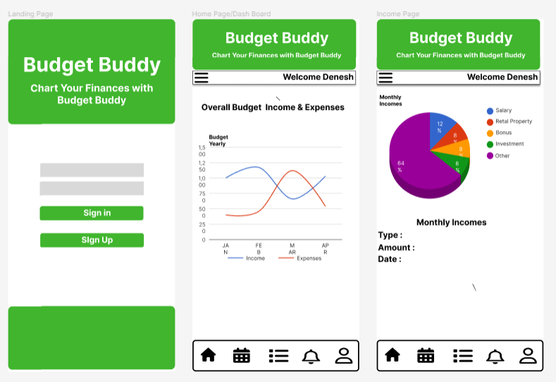
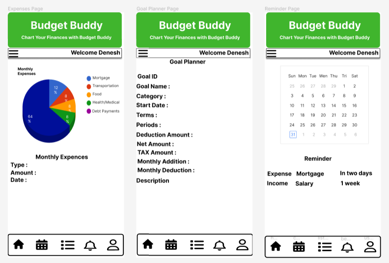

# Component Hierarchy Diagram

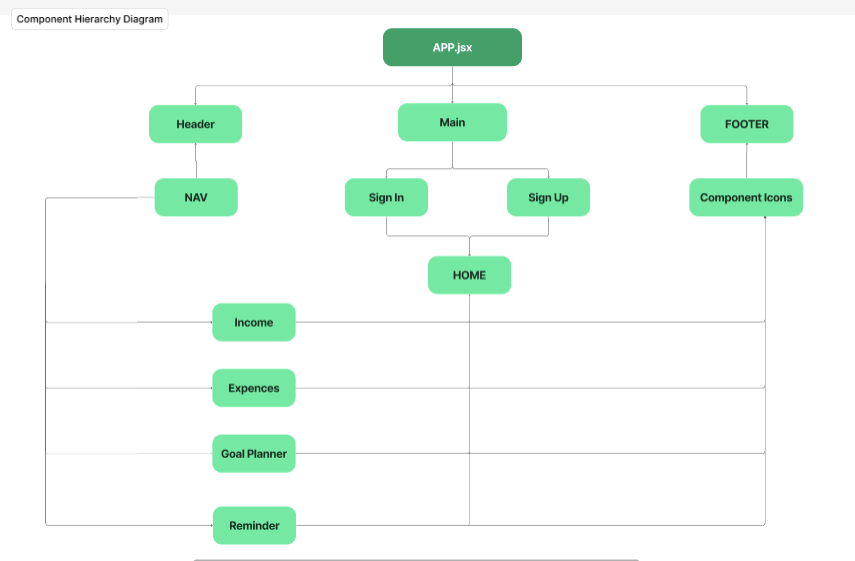

# ERD 
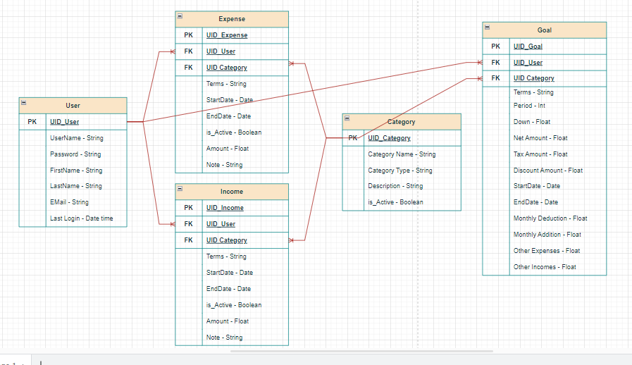

# Technology Architecture

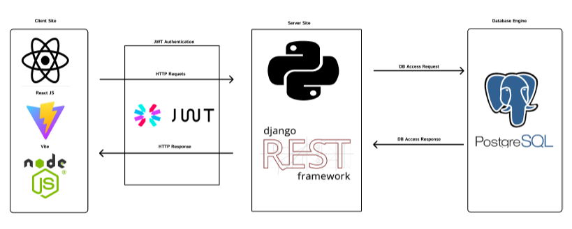

# User Stories 
--# Sign Up: As a user, I want to be able to create a new account on the Budget Buddy platform.

--# Sign In: As a user, I want to be able to log in to my existing account on the Budget Buddy platform.

--# Sign Out: As a user, I want to be able to log out of my account securely when I'm done using the Budget Buddy platform.

--# Manage Income: As a user, I want to be able to create, edit, update, and delete my income records on the Budget Buddy platform.

--# Manage Expenses: As a user, I want to be able to create, edit, update, and delete my expense records on the Budget Buddy platform.

--# View Existing Income and Expenses: As a user, I want to be able to view the list of my existing income and expense records on the Budget Buddy platform.

--# View Monthly Average Income and Expenses: As a user, I want to be able to view the monthly average income and expenses represented in charts on the Budget Buddy platform, categorized based on different bill cycles.

--# View Calendar with Reminders: As a user, I want to be able to view a calendar feature on the Budget Buddy platform that includes reminders for important financial events or deadlines.

# Screenshorts

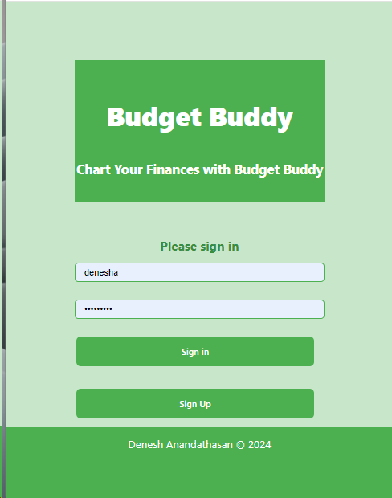
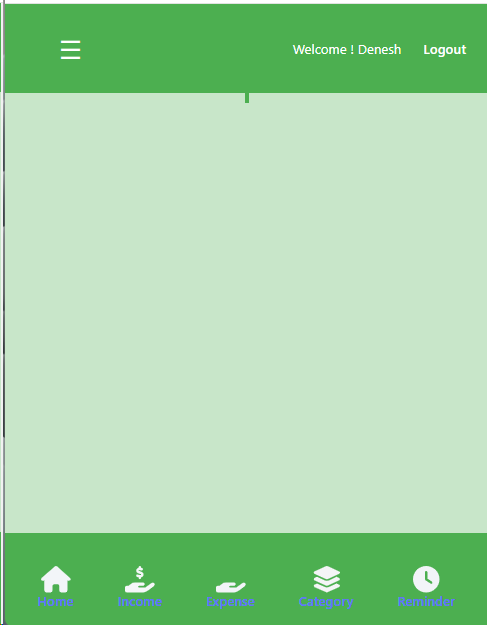
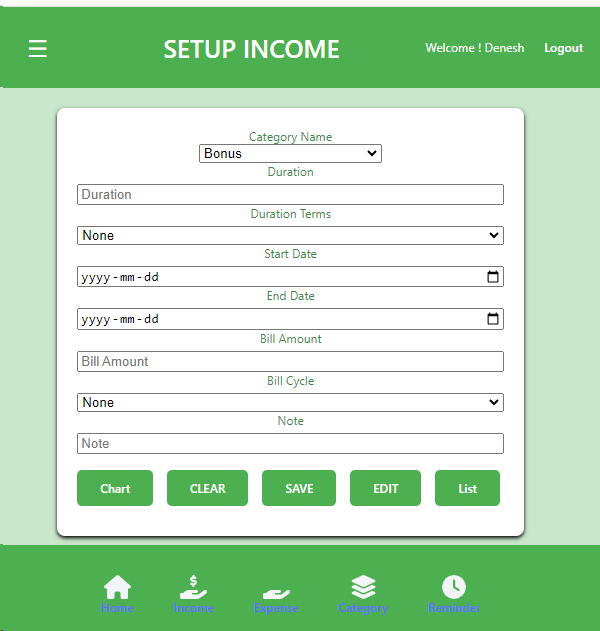
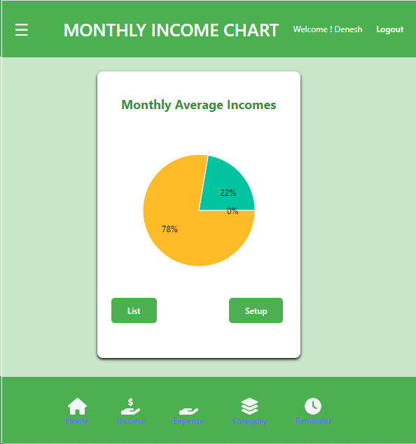
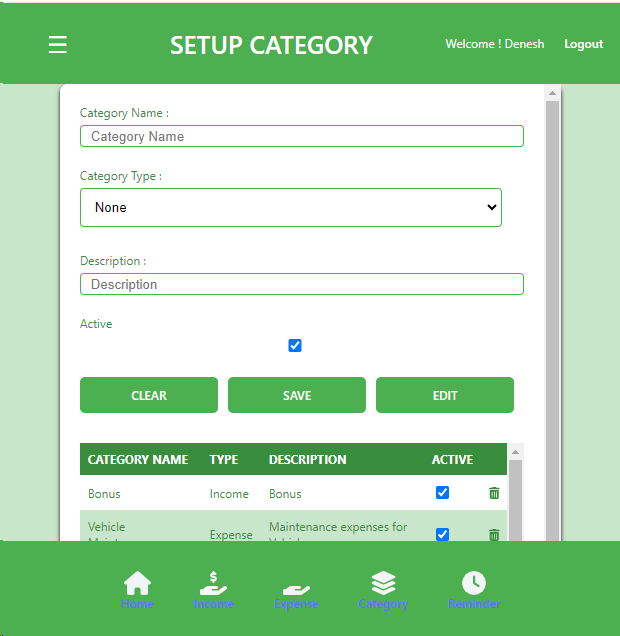
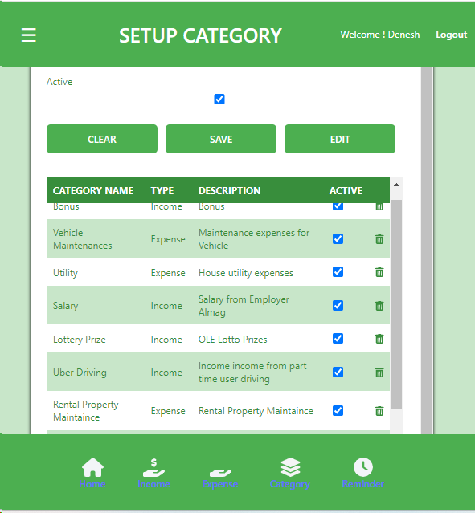
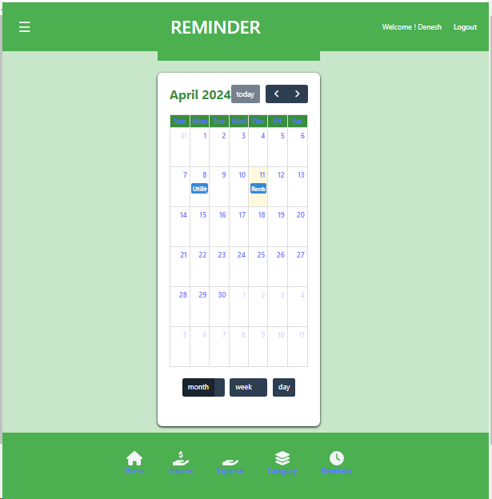
